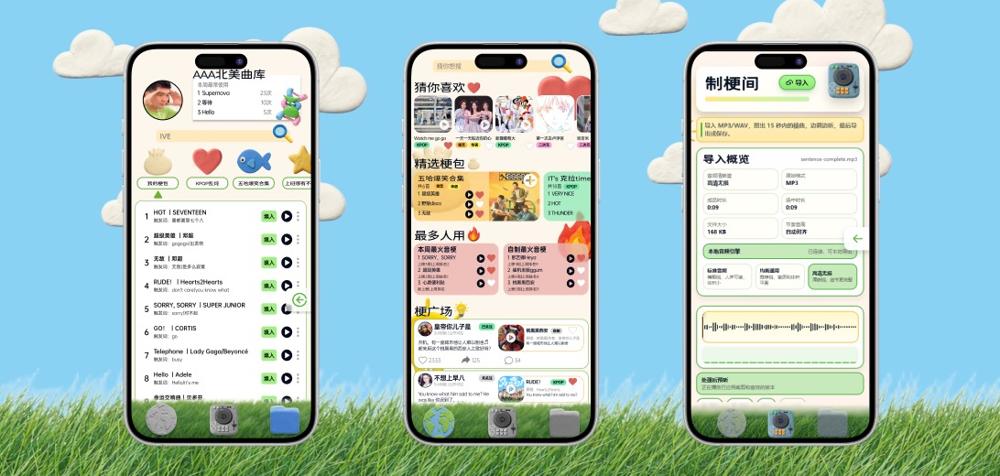

# 玩音梗

把打字变成触发音乐名场面的互动体验。它不是普通音乐播放器，而是一个面向聊天场景的“音乐版表情包”原型：用户输入文字后，系统实时识别最合适的音频梗，先试听，再像微信语音条一样发送给对方。

<p align="center">
  
</p>

## 项目亮点

- **实时文本识别**：输入框每次变化都会触发候选音梗匹配，只展示当前最优结果，也可展开查看多个候选。
- **聊天内发送体验**：支持普通文字发送、音频梗单独发送、语音条播放、时间分隔、对方视角展示和“一键 +1 跟发”。
- **梗世界**：以移动端 APP 画幅呈现推荐、精选梗包、热榜和社区广场，模拟真实内容生态。
- **梗库**：管理可命中的音梗条目，支持搜索、分类、填入触发词、试听和收藏。
- **制梗间**：导入 MP3/WAV 后进行 15 秒内裁剪、删除、保留、音量/淡入淡出/变速/变调/回声/变声处理，并支持实时预览和导出。
- **移动端视觉原型**：使用草坪、黏土图标、卡片和手机 APP 画幅，突出“轻娱乐 + 音乐社交”的产品感。

## 产品概念

<p align="center">
  
</p>

玩音梗解决的是聊天里“只有文字和表情包，不够会唱”的表达空缺。对于音乐梗、歌词梗、圈层梗，完整转发歌曲太重，自己唱又不稳定；这个 demo 尝试把聊天输入和短音频梗绑定起来，让文字天然带上最贴切的音乐片段。

## 功能结构

<p align="center">
  
</p>

项目主要由三块组成：

| 模块 | 作用 |
| --- | --- |
| 梗世界 | 官方推荐、精选梗包、热榜和 UGC 广场 |
| 制梗间 | 上传音频、框选裁剪、实时试听、效果处理和导出 |
| 梗库 | 收藏、管理、搜索、填入和启停个人音梗 |

## 技术实现

<p align="center">
  
</p>

### 1. 多模态语义触发匹配

匹配逻辑位于 `src/utils/match.js`，把用户输入、触发词、歌曲元数据和收藏/使用行为映射到统一评分空间：

- 字符归一化：统一大小写、全角半角、标点与空白。
- 编辑距离：用 Levenshtein 衡量短文本相似度。
- 双字片段重叠：用 Dice score 增强中文/短句模糊匹配。
- 包含与前缀加权：输入 `go` 时，开头命中比中段命中得分更高。
- 行为加权：收藏和常用音梗会获得小幅排序提升。

### 2. 轻量级音频处理链路

音频处理位于 `src/utils/audioClip.js` 和 `server/audio-engine.mjs`：

- 浏览器端使用 Web Audio API 解码、裁剪、波形摘要、频谱摘要和实时预览。
- 支持 WAV/MP3 导出，MP3 编码使用 `lamejs`。
- 支持裁剪保留、删除选区、撤销、播放线同步、变速不变调、变调不变速、回声、降噪和音色变化。
- 可选本地 Express 音频服务，用于更稳定的处理接口。

## 商业与生态设想

<p align="center">
  
</p>

这个原型的长期方向是从单点工具扩展到音乐梗生态：

- 用低门槛工具把热门歌曲片段转化成可传播的聊天表达。
- 通过梗库、收藏、社区广场沉淀用户自己的表达资产。
- 让官方推荐和用户 UGC 共同形成“音乐梗包”分发机制。
- 未来可接入更完整的版权、推荐、音频生成和社交平台链路。

## 技术栈

- React 19
- Vite 7
- Phosphor Icons
- Web Audio API
- Express 本地音频处理服务
- lamejs MP3 编码

## 本地运行

```bash
npm install
npm run dev
```

访问：

```text
http://127.0.0.1:5173
```

如果要同时启动本地音频处理服务：

```bash
npm run dev:full
```

## 构建

```bash
npm run build
```

## 音频素材说明

公开仓库默认不包含真实歌曲 MP3 文件，避免把未授权音乐素材发布到公共仓库。代码中的曲库元数据仍保留在 `src/data/tracks.js`，如需完整试听，请将已授权的短音频片段放入：

```text
public/audio/library/
```

文件名需与 `src/data/tracks.js` 中的 `audioUrl` 对应。

## 目录结构

```text
.
├── docs/images/          # README 展示图
├── public/figma-622/     # APP UI 视觉素材
├── public/ui-622/        # 必需字体资源
├── scripts/              # 音频导入脚本
├── server/               # 本地音频处理服务
├── src/
│   ├── assets/           # 匹配条 SVG 图标
│   ├── data/             # 音梗曲库元数据
│   ├── utils/            # 匹配算法与音频处理
│   ├── App.jsx
│   └── App.css
├── index.html
├── package.json
└── vite.config.js
```

## 状态

这是一个面向产品演示和 Hackathon 展示的高保真 Web 原型，重点验证“聊天输入触发音乐梗”的交互价值、匹配策略和移动端视觉体验。
